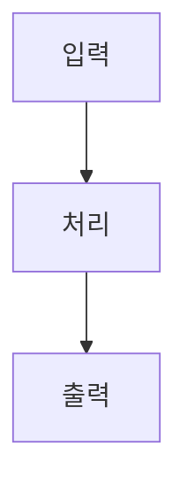

<!-- explain-pr 이해문서 템플릿. 각 <...>를 채우고 이 주석 줄은 지운다. -->
# 개발자 이해문서 — <PR 제목>

- PR/MR: <링크 또는 (생성 전)>
- 브랜치: <head> ← <base>
- 작성: <YYYY-MM-DD> · 문맥: <warm | cold(⚠️추정 포함)>

## 1. TL;DR
<이 PR이 무엇을 하는지 3줄로>

## 2. 왜
<배경 · 해결하려는 문제 · 목표 · 제약>

## 3. 무엇을 바꿨나
<변경 요약 + 핵심 파일/모듈. 표나 불릿으로>

## 4. 설계
<이해에 필요한 mermaid 1~2개(flow/sequence/component 중 택). 장식용 다이어그램 금지>

## 5. 주요 결정과 버린 대안
<결정 → 이유 → 버린 대안 → trade-off>

## 6. 동작 확인 방법
<어떻게 검증했나 / 리뷰어가 재현할 커맨드·테스트>

## 7. 후속·리스크·함정
<알려진 한계 · 후속 작업 · 조심할 지점>
