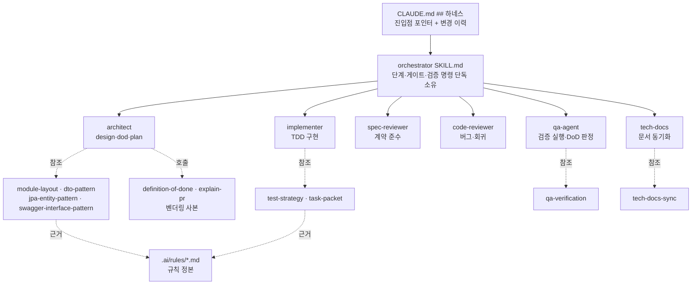

# 개발자 이해문서 — 하네스를 aic-api 구조로 재구성

- PR/MR: (생성 전)
- 브랜치: `chore/harness-aic-api-alignment` ← `dev`
- 작성: 2026-08-31 · 문맥: warm

## 1. TL;DR

`.claude/` 하네스를 사내 `aic-api` 저장소와 같은 구조 — 에이전트 6축 + 진입 스킬 `orchestrator` +
패턴 스킬 8 + 벤더링 스킬 2 — 로 교체했다. 기존 8에이전트/9스킬은 2026-04 구성 이후 갱신되지 않아
**지금 따르면 규칙 위반 코드를 만드는 상태**였다(마이그레이션 경로가 실제와 다르고, 앱 안에
`repository/`·`cache/` 패키지를 만들라고 지시). 애플리케이션 코드는 한 줄도 바뀌지 않았고 변경은
`.claude/`·`CLAUDE.md`·`docs/work/`에 갇혀 있다.

## 2. 왜

하네스 감사에서 8건의 drift가 나왔다. 그중 셋은 문서를 믿고 따르면 곧바로 사고가 난다.

| drift | 하네스가 지시한 것 | 저장소의 실제 |
|-------|------------------|-------------|
| 마이그레이션 위치 | `apps/api/src/main/resources/db/migration/` | `infrastructure/common/src/main/resources/db/migration/` |
| 마이그레이션 버전 | "V1~V9 기준", 없어진 `origin/feature/premium` 브랜치 조회 | 최신 `V15__add_tracking_close_snapshot.sql` |
| 패키지 배치 | apps 안에 `domain/`·`infrastructure/`·`repository/`·`cache/`·`client/` | `.ai/rules/architecture.md`·`batch.md`가 **금지**. 기술 구현은 `infrastructure:{common,api,batch}` 소유 |
| 네이밍 | `{Name}RepositoryImpl`, `Jpa{Name}Repository` | `*Adapter`, `SpringData*Repository` |
| 검증 명령 | `./gradlew test`, `:apps:api:integrationTest`만 | `architectureTest`·`--offline --no-daemon`·`verifyMigrations`가 규칙상 필수 |

원인은 단순하다. 하네스 문서를 검사하는 장치가 없어서, 모듈 재편·Flyway 소유권 이동·MarketPair
재구조화(V12~V15)가 지나가는 동안 아무도 실패하지 않았다. 4개월간 조용히 낡았다.

목표는 "aic-api와 같은 **구조**, 내용은 이 저장소의 **실제 계약**"이다. aic-api는 Java/PostgreSQL/Kafka
Outbox이고 이 저장소는 Kotlin/MySQL·Redis/WebSocket ingestion·durable notification이라, 문장을 그대로
옮기면 새로운 drift를 만든다.

## 3. 무엇을 바꿨나

| 구분 | 내용 |
|------|------|
| 에이전트 (6) | `architect`(opus) · `implementer`(sonnet) · `spec-reviewer`(opus) · `code-reviewer`(opus) · `qa-agent`(sonnet) · `tech-docs`(sonnet). frontmatter에 `name`·`description`·`tools`·`model` 4키를 넣어 자동 배정과 도구 제한이 걸리게 했다 |
| 진입 스킬 | `.claude/skills/orchestrator/` — ⓪ 컨텍스트 확인 → ① worktree → … → ⑪-d 피드백 수집 |
| 패턴 스킬 (8) | `module-layout` · `dto-pattern` · `jpa-entity-pattern` · `swagger-interface-pattern` · `test-strategy` · `qa-verification` · `tech-docs-sync` · `task-packet` |
| 벤더링 (2) | `definition-of-done` · `explain-pr` — 개인 홈(`~/.claude/skills`) 의존을 없애려 저장소에 실제 파일로 커밋 |
| 삭제 | 에이전트 8(analyzer·planner·db-migrator·frontend-dev·qa-validator·tech-writer 등) · 스킬 9(planning·api-feature·batch-job·db-migration·frontend·qa-validator·code-review·tech-docs·premium-orchestrator) + 빈 `references/` 8개 |
| `CLAUDE.md` | `## 하네스` 섹션 신설 — 진입점·산출물 위치·**자동 게이트 없음** 명시 + 변경 이력 표 |

핵심 파일은 `.claude/skills/orchestrator/SKILL.md`(365줄)다. 단계·승인 게이트·스킵 규칙·검증 명령을
이 파일이 단독으로 소유하며, 나머지 에이전트/스킬은 여기서 호출된다.

## 4. 설계



규칙의 정본은 여전히 `.ai/rules/*`다. 하네스는 규칙을 **참조**할 뿐 복제하지 않는다 — 복제하면
이번에 고친 것과 같은 방식으로 다시 갈린다. 같은 이유로 `CLAUDE.md`는 에이전트·스킬 목록을 적지 않고
"파일 시스템에서 직접 확인한다"고만 적는다.

## 5. 주요 결정과 버린 대안

**결정 1 — 새 자산을 먼저 세우고 구 자산은 마지막에 지운다.**
반대 순서(먼저 삭제 후 작성)면 중간 커밋들에서 하네스가 통째로 비는 구간이 생긴다. 그 상태에서
세션이 끊기면 다음 사람이 진입점 없는 저장소를 만난다.

**결정 2 — `swagger-interface-pattern`을 만들되 "현재 없다"를 명시했다.**
이 저장소엔 `@Operation`·`*ControllerDocs` 코드가 없고 springdoc 의존만 있다. 사용자가 aic-api와 스킬
1:1 대응을 선택했으므로 파일은 만들되, **실효 계약은 `http/api/*.http` + contract test**임을 본문 첫
절에 박고 "이 스킬은 ControllerDocs 도입을 강제하지 않는다"를 명시했다. 버린 대안은 (a) 스킬 생략 —
1:1 구조가 깨진다, (b) aic-api 문장 그대로 이식 — 코드에 없는 패턴을 규칙으로 서술하게 되어 이번에
고친 drift를 새로 만든다.

**결정 3 — `harnessCheck` 자기검증 게이트는 이번에 넣지 않았다(사용자 결정).**
aic-api에는 `scripts/harness-check.sh`(353줄)가 `lint`에 물려 죽은 참조·frontmatter 파손·단계 순서를
CI에서 잡는다. 이번 스코프에서는 제외하기로 했고, 대신 그 사실을 `CLAUDE.md`와 `orchestrator`에
**명시적으로 적었다**. 검증은 이번 PR에서 1회 수동 실행했다(§6).

**결정 4 — baseline을 `origin/dev`로 고정.**
로컬 `dev`가 100 커밋 stale이라 `dev...HEAD`로 범위를 재면 남의 작업 120개 파일이 딸려 들어온다.
worktree도 `origin/dev`에서 직접 분기해 사용자의 미커밋 변경(`deploy/*`, `.gitignore`)을 건드리지 않았다.

## 6. 동작 확인 방법

```bash
# 1) 하네스 인벤토리 — 에이전트 6 / 스킬 11
ls .claude/agents .claude/skills

# 2) 벤더링 사본이 실제 파일인지 (심볼릭 링크면 클론·CI에서 깨진다)
git ls-files -s .claude/skills/definition-of-done .claude/skills/explain-pr   # 100644/100755 이어야 함
diff -r /home/yeop/.claude/skills/explain-pr .claude/skills/explain-pr        # 원본 보유자만 재현 가능

# 3) CLAUDE.md 하네스 포인터 + 변경 이력
grep -Pzoq '## 하네스[\s\S]*?### 변경 이력' CLAUDE.md

# 4) 정본 문서 무결성 (CI quality-gate.yml 와 동일)
bash docs/check-documentation.sh

# 5) 회귀 — 코드 무변경이므로 컴파일은 그대로여야 한다
./gradlew compileKotlin --offline --no-daemon

# 6) 변경 범위가 하네스·문서 밖으로 나가지 않았는지
git diff --name-only origin/dev...HEAD | grep -vE '^(\.claude/|CLAUDE\.md$|docs/work/)'   # 출력 없어야 함
```

실행 결과와 판정은 `docs/work/harness-aic-api-alignment/dod.md`의 증거 로그에 있다
(T1 4건 PASS · T3 4건 기록 · 판정 PASS).

## 7. 후속·리스크·함정

**함정 1 — 벤더링 사본은 `cp -r`로 만들면 안 된다.**
`~/.claude/skills/definition-of-done` 자체가 `/home/yeop/dev/ai-skills/shared/...`로의 심볼릭 링크다.
`cp -r`은 그 링크를 그대로 복사해 git에 **mode 120000**으로 들어가고, 클론·CI·다른 머신에서는 스킬이
로딩되지 않는다. 더 나쁜 건 `diff -r` 검증이 양쪽 모두 같은 대상을 따라가 **통과해버린다**는 점이다
(코드 리뷰가 잡았다). `cp -rL`로 복사하고 `git ls-files -s`로 mode를 확인해야 한다. worktree가
`/mnt/c`(DrvFs)에 있으면 실행 비트도 죽으므로 `git update-index --chmod=+x`가 추가로 필요하다.

**함정 2 — 하네스 문서의 경로는 아무도 검사하지 않는다.**
이번 PR이 고친 drift가 정확히 그 결과물이다. `.claude/**`를 고친 뒤에는 문서가 가리키는 경로가
실재하는지 직접 확인하고 `CLAUDE.md` 변경 이력에 한 행을 남긴다.

**리스크 — 게이트가 없으니 같은 방식으로 다시 낡는다.** 재발 방지가 필요해지면 aic-api의
`scripts/harness-check.sh` 이식을 별도 작업으로 연다(참조 무결성 · frontmatter · 계약 단정 3축).

**후속 후보**

- `.ai/skills/tdd-workflow/SKILL.MD` — `.claude/skills/` 밖 + 확장자 대문자라 로딩되지 않는 고아 자산.
  이번 스코프 밖이라 손대지 않았다.
- `AGENTS.md`에는 하네스 포인터를 넣지 않았다. 동결된 DoD 범위(AC6은 `CLAUDE.md`만)를 조용히 넓히지
  않으려는 판단이며, Codex 세션도 같은 하네스를 보게 하려면 한 줄 포인터를 추가하는 후속이 필요하다.
