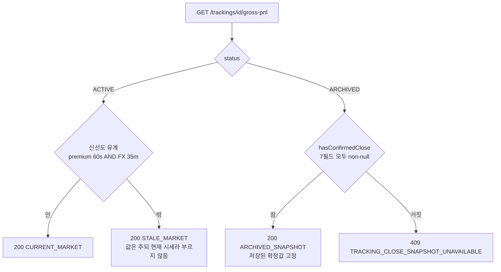
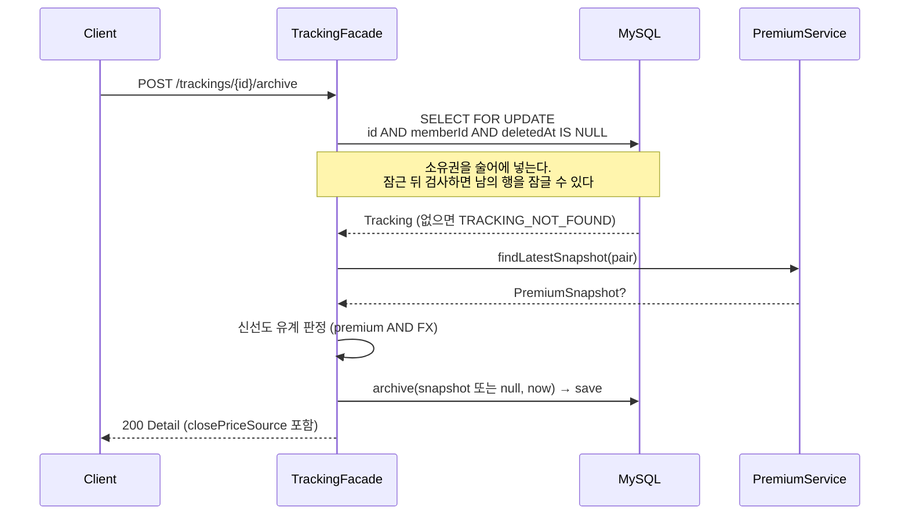

# Phase 0 — 개발자 이해문서

| 항목 | 값 |
|---|---|
| 브랜치 | `refactor/private-live-autotrader-phase-0` |
| base | `dev` (`5319a2d`) |
| 스펙 | [`design.md`](design.md) · [`plan.md`](plan.md) · [`dod.md`](dod.md) |
| 상위 프로그램 | [`../private-live-autotrader/design.md`](../private-live-autotrader/design.md) |

## 1. TL;DR

기존 `Position` 기능은 **실제 주문을 내지 않는데 모든 표면이 주문을 내는 것처럼 보였다.** 이름·경로·문구를
`tracking` 으로 바꿔 그 사실을 드러냈다.

종료된 추적의 손익이 **현재 시세를 따라 계속 변하던 실제 결함**을 청산 시점 스냅샷 확정으로 고쳤다.

gross 손익이 "현재 PnL" 로만 표시되던 것을 응답 스키마와 화면이 **제외 항목·백분율 분모·시세 신선도를
스스로 말하게** 바꿨다.

## 2. 왜

상위 프로그램 spec 이 Phase 0 에 배정한 계약은 `P0-O1`~`P0-O5`, `SEM-1`~`SEM-4`, `ARCH-7`, `ARCH-9` 다.
핵심은 "이미 존재하는 기능이 **무엇이 아닌지**" 를 일치시키는 것이다. 자동매매를 만들기 전에 용어가
거짓말하고 있으면 이후 Phase 가 그 거짓 위에 쌓인다.

`dev` 코드를 읽어 확인한 사실이 근거다.

- `Position` aggregate 에 주문 ID·체결 ID·거래소 응답·수수료가 **없다.** 주문 record 타입 자체가 저장소에
  존재하지 않는다. 그런데 `POST /positions/auto`, `POST /{id}/close`, 화면의 "포지션 열기 (AUTO)" 는 전부
  주문으로 읽힌다. `auto` 는 주문 자동화가 아니라 **입력값 자동 채움**이었고 그 사실은 코드 밖 어디에도
  없었다
- `close()` 가 `status` 만 뒤집고 청산 시세를 저장하지 않았다. `/pnl` 에 상태 가드가 없어 종료한 추적을
  며칠 뒤 열면 손익이 달라져 있었다. 목록 화면이 `OPEN` 만 조회해 우연히 이 문제를 피하고 있었을 뿐이다
- `totalPnlPercent` 의 분모가 **현재** 한국 leg 명목가였다. 진입 자본도 계정 자산도 아니다. 같은 손익이라도
  시세가 오르면 백분율이 작아진다
- `foreignLeverage` 는 저장·검증·응답까지 있으나 **어떤 계산에도 쓰이지 않았다**

## 3. 무엇을 바꿨나

| 영역 | 변경 |
|---|---|
| REST | `/api/v1/positions/*` → `/api/v1/trackings/*`. `auto`→`from-market`, `manual`→root, `history`→`archived`, `{id}/pnl`→`{id}/gross-pnl`, `{id}/close`→`{id}/archive` |
| 도메인 | `Position`→`Tracking`, 패키지 `domain/position`→`domain/tracking` 등 4개 계층. `@Table(name = "position")` 은 유지 |
| 상태 | domain·API 는 `ACTIVE`/`ARCHIVED`, **DB 저장값은 `OPEN`/`CLOSED` 유지**. `TrackingStatusConverter` 가 매개 |
| 스키마 | `V15` — 청산 스냅샷 8컬럼 추가. **`ALTER` 한 문장만** |
| 응답 | `priceBasis`·`pnlBasis`·`observedAt`·`fxObservedAt` 추가. 필드명이 gross 여부와 분모를 말한다 |
| 화면 | 경로·컴포넌트 rename, 고지 8종을 `TrackingNotices.tsx` 한 곳에 모아 목록·상세가 공유 |
| 테스트 | `apps/web` 에 vitest + Testing Library 도입 (없었다). CI web job 에 `npm run test` 추가 |

**핵심 파일**

- `domain/tracking/Tracking.kt` — `hasConfirmedClose`(확정 판정 단일 정의), `archive()`, `grossPnl()`
- `domain/tracking/TrackingStatusConverter.kt` — DB legacy 표현 ↔ domain 정렬 표현
- `apps/api/application/tracking/TrackingFacade.kt` — `inBounds()` 신선도, 잠금 archive, `priceBasis` 분기
- `infrastructure/common/.../jpa/tracking/SpringDataTrackingRepository.kt` — 소유권 결합 `FOR UPDATE`
- `apps/web/src/components/TrackingNotices.tsx` — 사용자 고지 단일 출처

## 4. 설계

### 확정 판정과 `priceBasis`



`hasConfirmedClose` 는 **확정 응답이 노출하는 모든 값의 원천을 포함한다.** 응답에 필드를 추가하면 그 원천
컬럼도 규칙에 들어가야 한다. 초안은 가격 4개만 검사해 `close_observed_at` 이 `NULL` 인 부분 행이
`observedAt` 없이 통과할 수 있었다.

### archive 트랜잭션



시세를 확정하지 못해도 **archive 는 성공한다.** 확정 실패는 종료를 막는 사유가 아니라 그 종료가 확정 손익을
갖지 못한다는 사실일 뿐이고, 그 사실은 `gross-pnl` 조회 시점에 `409` 로 드러난다.

## 5. 결정과 버린 대안

**D1. 도메인 타입까지 rename** — 문구만 고치면 `openAuto`·`close` 라는 이름이 계속 주문을 암시한다.
`SEM-2` 는 추적 record 와 execution record 를 같은 개념으로 재사용하지 못하게 하는데, 지금 이름을 비워
두어야 Phase 3 의 실제 체결 결과가 `Position` 이라는 정확한 단어를 쓸 수 있다.

**D4. DB 저장값은 유지** — 초안은 `V15` 가 `status` 값을 `ACTIVE`/`ARCHIVED` 로 재작성했다. 그러면 롤백한
이전 image 가 `valueOf("ACTIVE")` 에서 죽어 **롤백 자체가 불가능해진다.** `docs/runbooks/deployment.md`
"Rollback 제약" 이 forward migration 의 이전 image 호환을 요구한다. converter 방식이 같은 안전성을 더 적은
상태로 얻는다. 버린 대안: expand/contract 2단계 배포 — 개인 제품에서 "다음 배포" 가 보장되지 않아 영구
이중 상태로 남을 위험.

**`V15` 는 `ALTER` 단독** — 초안은 `LEGACY_UNKNOWN` backfill `UPDATE` 를 붙였다. MySQL DDL 은 `ALTER` 와
`UPDATE` 를 원자화하지 않으므로, `ALTER` 성공 후 실패하면 컬럼은 있는데 Flyway 이력이 없어 **다음 배포가
중복 컬럼 오류로 막힌다.** backfill 은 애초에 불필요했다 — 확정 판정 규칙이 `NULL` 을 이미 fail-closed 로
처리한다. `LEGACY_UNKNOWN` enum 값도 함께 제거했다.

**identity 는 판정만** — `MarketPair` 에 instrument class·quote currency 를 추가하지 않았다. premium·ticker·
notification 전 도메인과 Redis key·집계 테이블·runbook 에 파급되고, 최소 수집 계약(`P1-O1`)을 확정하는
Phase 1 이 확장 형태를 함께 결정하는 편이 정확하다.

## 6. 동작 확인 방법

```bash
# 정적 수용기준 (빠름)
bash docs/work/private-live-autotrader-phase-0/verify.sh --static

# 전체 (T4 증거까지 요구한다. 승인 전에는 --pre-approval)
bash docs/work/private-live-autotrader-phase-0/verify.sh

# JVM
./gradlew test architectureTest --offline --no-daemon
./gradlew :infrastructure:common:verifyMigrations --offline --no-daemon

# Web — CI 와 같은 node 20 을 쓴다. node 18 에서 npm install 하면 네이티브 바인딩이 깨진다
nvm use 20
npm --prefix apps/web ci --include=optional
npm --prefix apps/web run lint && npm --prefix apps/web run test && npm --prefix apps/web run build
bash ci/quality-gate-contract-test.sh
```

## 7. 후속·리스크·함정

### 배포 시 수 분의 Web 단절 — 수용된 결정 (`AC27`)

배포 순서가 API → Batch → Web 이라 그 구간에 **이전 Web 이 새 API 를 호출해 404 를 받는다.** 호환 alias 나
`308` 리다이렉트로 해결되지 않는다 — 경로뿐 아니라 응답 필드명과 상태값이 함께 바뀌므로 경로만 살려도
이전 Web 이 응답을 해석하지 못한다. 순서 역전도 대칭적으로 깨진다.

사용자가 **"그대로 수용"** 을 선택했다. 영향 범위가 소유자 본인의 추적 화면 하나이고 배포 시점을 소유자가
정하기 때문이다. **롤백 자체는 안전하다** — 세 image 를 함께 되돌리고 `V15` 는 추가 컬럼뿐이다.

### 이전 image 가 만든 행

`V15` 적용 후 이전 image 가 종료시킨 행은 `status` 만 바뀌고 신규 컬럼이 `NULL` 로 남는다. 확정 판정이
fail-closed 로 처리하므로 `gross-pnl` 은 `409`, 화면은 "종료 시각 불명" 을 표시한다. **`updatedAt` 으로
대체하지 않는다** — 그것은 종료 시각이 아니다.

### 남은 한계 — leg 별 관측 시각이 없다

`PremiumSnapshot.observedAt` 은 `maxOf(bithumb, binance, fx)` 라 **가장 최신** 값이다. 낡은 구성요소를
가린다. FX 는 `fxObservedAt` 이 따로 있어 분리 검사했지만 한국·해외 ticker 는 leg 별 시각 필드 자체가 없어
검출할 방법이 없다. 따라서 `MARKET_SNAPSHOT` 이 보장하는 것은 "가장 최신 관측 시각이 신선했고 FX 가 별도로
신선했다" 이지 "세 값이 동시에 신선했다" 가 아니다. 화면 배지를 "확정값" 이 아니라 **"관측값 기준"** 으로
쓴 이유다. `OPEN-6` 으로 Phase 1 에 넘겼다.

### 저장된 quote 는 USDT 가 아니라 USD

`Currency` enum 에 `KRW`·`USD` 뿐이고 batch 가 수집 시점에 `"USDT" -> Currency.USD` 로 정규화한다. legacy
데이터는 USDT 라는 실제 quote 를 보존하지 않는다. Phase 1 이 legacy 를 "USDT 무기한선물 증거" 로 재사용하면
안 된다. `OPEN-7`.

### 스펙 리뷰가 자연 수렴하지 않았다

외부 리뷰 18라운드에서 지적 45건을 처리했으나 마지막 라운드까지 high 가 나왔다. `dod.md` `## 변경 요청`
`CR-1` 이 이 사실과 남는 위험을 기록한다. 미발견 설계 결함은 코드 리뷰와 T2 자동 기준이 담당한다.

### 함정 — 검사기가 거짓말한다

이번 작업에서 **검사기 자체의 결함을 8번** 고쳤다. 앞으로 이 저장소에 검증 스크립트를 쓸 때 같은 부류를
조심해야 한다.

| 부류 | 사례 |
|---|---|
| 도구가 PATH 에 없음 | `rg` 가 비대화형 셸에 없어 구현 전에도 GREEN |
| 검사 범위 오류 | `git diff --check` 가 working tree 만 봐서 커밋 후 항상 통과 |
| 종료 코드 무시 | bash 블록의 exit 는 **마지막 명령**의 것 — 앞선 gradle 실패가 묻힘 |
| blacklist 우회 | SQL 문법 변형 6종이 차례로 뚫음 → allowlist 로 뒤집고 내용 대조 gate 추가 |
| 기대 집합 자기 유도 | 검사 대상 문서에서 기대값을 뽑아 행을 지우면 공허하게 통과 |
| 누락 은폐 | 러너가 명령 블록 없는 AC 9개를 조용히 건너뛰고 GREEN 보고 |
| 오탐 | 패턴이 넓어 유지 대상까지 "제거 미이행" 으로 잡음 |
| 구간 오독 | 증거 로그 대신 수용기준 표를 읽어 모든 T4 를 "기록됨" 으로 오판 |

공통 교훈은 **검사기가 실패를 감지하는지 mutant 로 증명하라**는 것이다. `AC23` 은 self-test 를 내장해
우회 표본을 먼저 잡아 보이고, 실패하면 본 검사 결과를 신뢰하지 않는다.
