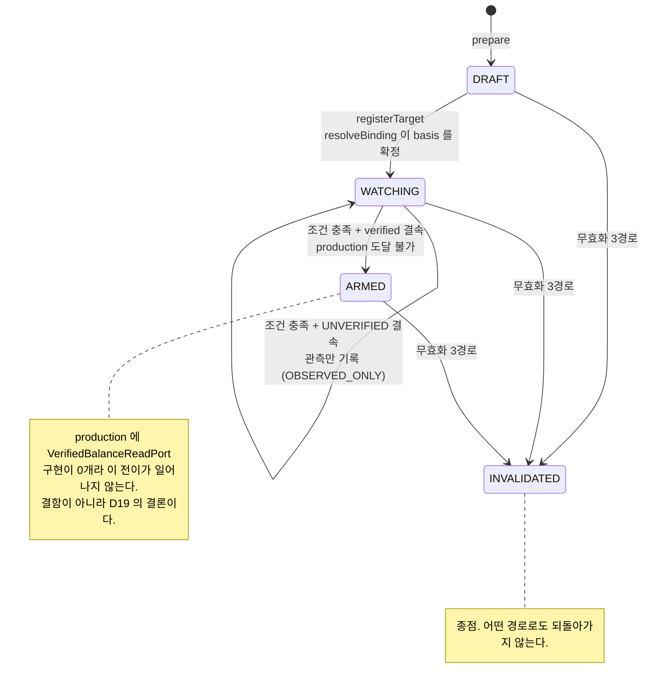
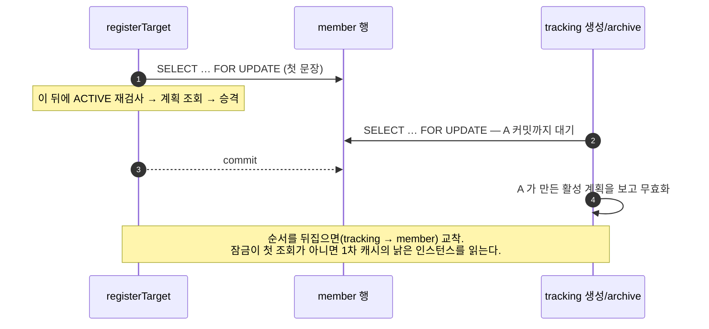

# 거래 준비 — 개발자 이해문서

| 항목 | 값 |
|---|---|
| 브랜치 | `feat/trade-preparation` |
| base | `dev` |
| PR | `#72` |
| 스펙 | [`design.md`](design.md) · [`plan.md`](plan.md) · [`dod.md`](dod.md) |
| 상위 프로그램 | [`../private-live-autotrader/design.md`](../private-live-autotrader/design.md) |
| 경제 모델 | [`../private-live-autotrader/eco-5-capital-cycle.md`](../private-live-autotrader/eco-5-capital-cycle.md) |

## 1. TL;DR

owner 가 잔고를 신고하면 ECO-5 §2 관계식으로 **물량과 레버리지를 계산**해 계획을 만든다. owner 가 진입 목표
프리미엄을 등록하면 계획이 `WATCHING` 으로 올라가고, 배치 Job 이 프리미엄을 보다가 조건이 충족되면
`ARMED` 로 전이한다.

**주문은 제출하지 않는다.** `ARMED` 가 이 단위의 종점이다.

그리고 **production 에서 `ARMED` 에 도달하는 경로가 없다.** 그것이 결함이 아니라 설계 결론이다 —
§4 를 읽어라. 이 단위가 production 에 제공하는 도달 상태는 `WATCHING` 까지다.

## 2. 왜

상위 spec 이 요구한 것은 "거래 준비" 요청이 **정말 계정에 그 금액이 있는지 확인하고** 그에 따라 레버리지와
물량을 계산하는 것이다. 여기서 두 가지가 갈린다.

**첫째, 레버리지는 독립 변수가 아니다.** ECO-5 §2 가 정리한 관계다.

```
R = B_k / (X · B_b)        두 계정 잔고 비율
L = R / (1 + P)            레버리지는 R 의 함수다
Q = B_k / K                K = F · X · (1+P)
```

`B_k` 빗썸 원화 잔고 · `B_b` 바이낸스 USD 잔고 · `X` 환율 · `F` 해외가 · `P` 진입 프리미엄.
owner 가 "몇 배로 할지" 고르는 게 아니라, 양쪽에 얼마를 넣었는지가 배수를 정한다. 그래서 캡은 레버 배수와
효율 비중 **양쪽**에 걸린다.

**둘째, 신고값으로는 "정말 있는지" 를 확인할 수 없다.** 그런데 실계정 조회는 `ACT-2` credential 승인이
선행돼야 한다. 이 단위는 그 사이에 놓인다 — 계산과 durable 계획까지는 만들고, **노출을 만드는 결정은
막는다.** 그 경계를 문서가 아니라 타입으로 그었다(§4).

## 3. 무엇을 만들었나

| 영역 | 내용 |
|---|---|
| Domain | `TradePrepSizing`(관계식 순수 함수) · `TradePreparation`(엔티티·상태 기계) · `TradePrepPolicy`(캡) · `BalanceSnapshot`/`VerifiedBalance`(신뢰 경계) · 포트 둘 |
| Migration | `V16` 계획 테이블(`active_key` generated column + unique index) · `V17` 평가 질의 인덱스 |
| Infrastructure | `DeclaredBalanceAdapter`(신고값→`UNVERIFIED`) · JPA 저장소 어댑터 |
| Application (api) | `TradePreparationFacade` 유스케이스 5개 · `TrackingFacade` 에 체결 무효화 producer 추가 |
| Interfaces | REST endpoint 5개 · `ApplicationError` 7개 신설 |
| Application (batch) | `TradePreparationEvaluationJob`(조건 평가) · `TradePreparationReconcileJob`(주기 대조) |

상태 기계와 잠금 순서는 §4 의 두 그림이 소유한다.

## 4. 설계

두 그림이 이 단위의 뼈대다. 첫째는 **무엇이 상태 전이를 막는가**, 둘째는 **왜 잠금 순서가 고정인가**다.



무효화 producer 셋 — owner 명시 refresh(REST) · 체결(`TrackingFacade`, 같은 트랜잭션) ·
주기 reconcile(batch Job).

`ACTIVE` tracking 과 활성 계획이 공존하지 못하게 막는 것은 **member 행 잠금**이다. 두 경로가 같은
행을 같은 순서로 잡아 직렬화된다.



교차 테이블 불변식이라 **version 술어도 unique index 도 이것을 막지 못한다** — 자세한 이유는 아래
"교차 테이블 불변식" 절에 있다.

### 신뢰 경계 — 관문은 `VerifiedBalance` 타입이 아니라 `boundBalanceBasis` 다

여기서 실제 결함이 한 번 났다. 반드시 정확히 알고 있어야 한다.

잔고 읽기를 **반환 타입이 다른 두 계약**으로 갈랐다(`D2`).

| 포트 | 캐시 | 용도 |
|---|---|---|
| `BalanceSnapshotReadPort` | 허용 | 표시용. 화면·계획 표시 |
| `VerifiedBalanceReadPort` | **불가** | 노출을 늘리는 결정 직전에만 |

`VerifiedBalance` 는 생성자가 `private` 이고 유일한 생성 지점이 `from(snapshot)` 이며, 그 함수는
`UNVERIFIED`·`UNAVAILABLE` 에 `null` 을 돌려준다. 그래서 "신고 잔고로는 판정용 타입을 만들 수 없다" 는
컴파일러가 강제한다(`D9`).

**그런데 무장 관문은 그 타입이 아니다.** `TradePreparation.evaluateCondition` 이 보는 것은 엔티티에 저장된
`boundBalanceBasis` 다. T5 초안은 `prepare` 가 결속한 **표시용** basis(캐시 허용이므로 `FRESH`/`STALE`)를
`registerTarget` 이 그대로 보존했고, 그래서 판정용 원천이 하나도 없는데 `STALE → ARMED` 가 성립했다.
`ACT-2` 가 추가하기로 한 것이 정확히 표시용 거래소 어댑터라, 설계가 예정한 시점에 활성화될 잠재 결함이었다.

지금은 `resolveBinding` 의 declared 분기가 **무조건 `UNVERIFIED` 로 강등**한다. 사슬은 이렇게 닫혀 있다.

- `evaluateCondition` 은 `WATCHING` 이 아니면 던진다
- `WATCHING` 을 대입하는 곳은 `registerTarget` 안 **한 곳뿐**이다
- 같은 메서드가 basis 를 `resolveBinding` 결과로 **덮는다**
- production 에 `VerifiedBalanceReadPort` 구현이 **0개**다(`D22`, `AC20` 이 강제)

**교훈:** 어떤 타입의 생성 지점을 전수 조사했다는 것은 그 타입이 **실제 관문일 때만** 증명이다. 관문이
무엇인지부터 확인하고 그것을 감사해라.

### owner 당 활성 계획 유일성은 DB 가 강제한다

```sql
active_key BIGINT AS (CASE WHEN status IN ('WATCHING','ARMED') THEN owner_id END) STORED,
UNIQUE KEY uk_trade_preparation_owner_active (active_key)
```

애플리케이션 코드로는 직렬화 격리 없이 막을 수 없다. 서로 다른 `DRAFT` 둘이 동시에 target 을 등록하면
둘 다 "기존 활성 계획 없음" 을 관찰하고 각자 성공하는 **phantom 경쟁**이 남는다(`D16`).

`STORED` 이므로 UPDATE 에서도 재계산된다 — `WATCHING → INVALIDATED` 는 `active_key` 가 `NULL` 로 풀려
슬롯을 해제하고, MySQL unique index 는 `NULL` 을 중복 허용하므로 비활성 행은 여러 개 공존한다.

유일성의 범위가 `WATCHING` 뿐 아니라 **`ARMED` 까지**인 이유(`D23`): `ARMED` 는 무기한 남으므로,
그 범위가 `WATCHING` 뿐이면 같은 owner 에 `ARMED` 와 `WATCHING` 이 공존해 같은 자본에 복수의 durable
실행 후보가 생긴다.

### 교차 테이블 불변식 — member 행을 먼저 잠근다

`ACTIVE` tracking 과 활성 계획은 **공존 커밋되어서는 안 된다.** 그런데 `registerTarget` 의 `ACTIVE` 검사와
tracking 생성은 서로 다른 테이블을 읽고 자기 테이블만 쓴다. 둘 다 커밋되면 write-skew 다 —
**version 술어는 한 행을, unique index 는 계획 행끼리를 지킬 뿐 교차 테이블 불변식은 어느 쪽도 못 지킨다**
(`D18`).

그래서 `registerTarget` 과 tracking 생성·archive 는 **트랜잭션 첫 문장에서 owner 의 member 행을
`SELECT … FOR UPDATE`** 로 잠근다. 잠금 순서는 항상 **member → tracking/plan** 이다.

**두 가지를 뒤집지 마라.**

1. **순서.** archive 는 이미 `findOwnedByIdForUpdate` 로 tracking 행을 잠근다. member 를 먼저 잡지 않으면
   생성 경로(member → tracking)와 반대가 되어 교착이 생긴다.
2. **잠금이 트랜잭션의 첫 조회여야 한다.** 앞에 `findById` 를 두면 엔티티가 1차 캐시에 먼저 올라가고,
   뒤따르는 `FOR UPDATE` 는 DB 잠금은 잡되 **낡은 인스턴스**를 돌려준다. Phase 0 에서 실측으로 확인된
   결함이다(동시 6요청 중 4건 통과).

`prepare` 는 잠그지 않는다. `DRAFT` 는 `active_key` 가 `NULL` 이라 금지된 공존 상태를 만들지 않고,
그 상태를 만드는 `registerTarget` 이 잠근 뒤 재검사한다.

### `recordFromMarket` 이 유일하게 뚫려 있던 경로

tracking 생성 경로는 둘이다. 수동 `record` 는 INSERT 가 첫 문장이라 **`fk_position_member` 의 FK 검사가
부모 member 행에 공유 잠금을 요청해** 우연히 직렬화된다. 자동 `recordFromMarket` 은
`premiumService.findLatestSnapshot` 이 INSERT 보다 먼저 consistent read view 를 연다 — tracking 측
`lockOwner` 가 없으면 FK 가 write 는 직렬화해도 무효화 SELECT 가 **0행**을 보고, `ACTIVE` tracking 과
`WATCHING` 계획이 나란히 커밋된다.

`recordFromMarket` 이 실제 production endpoint 다. 수동 경로만 테스트하면 이 결함이 보이지 않는다.

### premium 신선도는 양방향 유계다

```
armable = inBounds(premium.observedAt, now, MAX_AGE)   // 0 ≤ now − observedAt ≤ MAX_AGE
        && premium.marketPair == plan.marketPair
```

`now - observedAt <= MAX_AGE` 만 보면 생산자 clock skew 로 미래가 된 `observedAt` 이 음수 age 를 만들어
"신선" 으로 통과한다 — Phase 0 에서 실제로 났던 결함이라 같은 형태(`inBounds`)를 쓴다(`D14`).

`MAX_AGE` 는 설정이다. 근거는 수집 계약("관측값이 10초보다 오래되면 seconds 기록 중단")이고, 그보다 크게
잡으면 수집이 이미 멈춘 구간의 관측값으로 무장한다.

stream 최신값이 없으면 **평가를 멈추되 무효화하지 않는다.** `WATCHING` 으로 남았다가 회복 시 재개된다.

### reconcile 은 계획을 잔고보다 먼저 읽는다

이 순서가 정확성 조건이다. 반대로 하면 — 잔고 `S1` 읽음 → `registerTarget` 이 `S2` 결속 계획 커밋 →
`findAllActive()` 가 그 계획을 봄 → `S1 ≠ S2` → **방금 등록한 계획이 죽는다.**

`@Transactional` 안이라는 사실이 이걸 막지 못한다. `findForDecision()` 은 DB 읽기가 아니라 InnoDB read view
를 열지 않고, REPEATABLE READ 의 view 는 `BEGIN` 이 아니라 **첫 consistent read** 에서 열린다.

계획-먼저면 불변식이 성립한다 — `findAllActive()` 가 view 를 열므로 **그 뒤 커밋된 계획은 보이지 않고**,
**보이는 계획은 전부 잔고 읽기보다 앞서 커밋됐다.** 놓친 계획은 다음 사이클이 잡는다(늦어질 뿐 틀리지 않는다).

## 5. 결정과 버린 대안

| 결정 | 버린 대안과 이유 |
|---|---|
| 잔고 읽기를 두 타입으로 분리 (`D2`) | **단일 계약 + 짧은 TTL** — TTL 값을 정할 근거가 없고, 낡은 잔고가 노출을 승인하면 한쪽 leg 만 체결된 비헤지 상태가 된다 (`SAFE-9` 금지) |
| production `ARMED` 불가를 그대로 둔다 (`D19`) | **이름만 바꾼 신고값으로 경로를 연다** — `D9` 가 닫은 구멍을 다시 연다. 도달 불가가 올바른 상태다 |
| 참조 포지션은 **최근 종료된** 것 (`D8`) | **보유 중 포지션 참조** — 종료 판단용 gap 이 되는데 그건 §1.3 이 제외한 경로다. 거래 준비는 현재 준비금 기반이고, 준비금이 온전하다는 건 포지션이 없다는 뜻이다 |
| 남의 계획은 404 (`D10`) | **403** — 계획 ID 의 존재를 노출한다. Phase 0 이 `TRACKING_NOT_FOUND` 로 소유·존재·삭제를 구분하지 않기로 한 것과 같은 판단 |
| `ACTIVE` tracking 있으면 거절 (`D13`) | **허용** — 보유 중 잔고 상당분이 기존 포지션 증거금인데 신고값 기반이라 전액 가용으로 계산한다. 이중 포지션이 된다 |
| 캡 위반을 예외 대신 **결과**로 반환 | **예외만 던진다** — `AC3` 이 "위반한 캡을 응답에 명시" 를 요구하는데 예외만으로는 어느 캡인지가 사라진다 |
| 허가 목록이 비면 **전원 거부** | **전원 허용** — 설정을 빠뜨린 배포가 곧 `D10` 이 막으려던 상태가 된다 |

## 6. 동작 확인 방법

```bash
# DoD 동결 명령 18건을 표에서 직접 뽑아 순차 실행 (git-ignored 스크립트)
.superpowers/sdd/plan/gate.sh

# 전체 스위트
./gradlew test --rerun architectureTest --rerun --offline --no-daemon
./gradlew :infrastructure:common:integrationTest --rerun :apps:api:integrationTest --rerun \
          :apps:batch:integrationTest --rerun --offline --no-daemon
./gradlew :infrastructure:common:verifyMigrations --offline --no-daemon

# HTTP 샘플
http/api/trade-preparations.http
```

**`--rerun` 을 빼지 마라.** 이 저장소는 동결 명령이 **전 태스크 UP-TO-DATE 로 exit 0** 을 내고, 그 시점
XML 에 이전 필터 실행의 잔여가 남아 있던 전례가 있다. 그대로 기록하면 필터된 캐시가 전체 스위트 관측으로
남는다.

그리고 **`--rerun` 은 바로 앞 task 에만 붙는다.** task 가 둘인 명령(`AC5`)에서 끝에 하나만 붙이면 앞쪽이
캐시로 통과한다. `gate.sh` 는 `rerun-each.py` 로 task 마다 넣는다.

**ktlint 는 로컬에서 돌 수 없다.** `ci/bootstrap-quality-tools.sh` 가 네트워크 부트스트랩을 CI 전용으로
막는다(의도된 게이트다). CI job `5. ktlint + detekt` 가 유일한 검증 수단이다.

## 7. 후속·리스크·함정

### production `ARMED` 불가는 정상이다 — 우회로를 만들지 마라

가장 오해하기 쉬운 지점이다. "ARMED 에 못 가니까 뭔가 빠졌다" 고 판단해 경로를 열면 `D9` 가 닫은 구멍이
다시 열린다. 실원천(`ExchangeBalanceAdapter`)은 `ACT-2` 이후 **같은 코드로** 열린다.

### `ACT-2` 어댑터가 지켜야 할 전제 — 안정된 스냅샷 id

reconcile 은 스냅샷 id **부등치**로 무효화한다. 현재 트리의 id 생성 관례 둘은 관측마다 새 id 를 만든다
(`declared-${UUID}`, `recorded-$observedAt`). `ExchangeBalanceAdapter` 가 그대로 따르면 **모든 owner 의
모든 활성 계획이 매 사이클 무효화된다.**

`VerifiedBalanceReadPort` KDoc 에 계약으로 적어 뒀다 — **잔고가 그대로인 동안에는 id 도 그대로여야 한다.**
관측 시각이나 호출 횟수가 아니라 잔고 자체가 바뀔 때만 id 가 바뀐다.

### 통합 테스트가 Flyway 스키마 위에서 돌지 않는다 — 저장소 전역

`test` 프로파일이 `ddl-auto: create-drop` 이다(`modules/jpa/src/main/resources/jpa.yml`). 통합 테스트는
**Hibernate 가 엔티티 매핑에서 만든 스키마** 위에서 돈다. JPA 애너테이션으로 표현할 수 없는 DB 전용 제약은
테스트 시점에 **존재하지 않는다** — `V16` 의 `active_key` generated column 과 그 unique index 가 그렇다.

`AC11` 동시성 테스트가 제약 없는 스키마에서 통과할 뻔했다(순차 이중 `registerTarget` 이 두 번 다 성공하는
것으로 실증). 해당 테스트들만 **전용 컨테이너 + `ddl-auto: validate`** 로 우회했고 **저장소 기본값은
그대로다.** DB 전용 제약에 기대는 계약을 새로 추가하면 같은 함정에 다시 빠진다.

`V17` 인덱스를 넣을 때도 이게 걸렸다 — 마이그레이션에만 넣으면 배치 통합 테스트는 인덱스 없는 테이블에서
돌아 "인덱스 넣고도 롤백 테스트가 판별력을 갖는가" 확인이 공허해진다. 그래서 엔티티 `@Table` 에도 선언하고
둘의 일치를 단언한다.

### `AC16` 교차 ③ 이 조용히 무력화될 조건

교차 ③(`recordFromMarket`)의 판별력은 `JpaPremiumRepositoryAdapter.findLatestSnapshotByPair` 가 캐시 miss 에
**write-back 을 하지 않는다**는 사실에 의존한다. write-back 이 생기면 `createDraftPlan()` 의 `prepare` 가
캐시를 데워 `findLatestSnapshot` 이 DB 를 치지 않고, 교차 ③이 교차 ②로 퇴화한다 — **통과하면서 아무것도
재지 않게 된다.** `setUp` 의 `flushAll` 은 이것을 막지 못한다(테스트 시작 전만 비우고 캐시를 데우는
`createDraftPlan()` 은 그 뒤 실행된다). 테스트 KDoc 에 조건을 적어 뒀다.

### lint 가 DoD 에 없다

동결된 검증 명령 18건에 lint 가 없다. 저장소 CI 는 7개 job 인데 그중 `5. ktlint + detekt` 를 DoD 가 기준으로
삼지 않는다. 그래서 **로컬 게이트가 18/18 을 내는 동안 CI 는 PR 을 연 시점부터 빨간 상태였다.**
lint 를 `AC` 로 넣을지는 owner 판단이 필요하며, 로컬 실행 불가 제약 때문에 coverage 처럼 "CI artifact 를
최종 증거로 삼는다" 형태가 될 것이다.

### FX 원천이 하루 한 번만 갱신한다 — 프리미엄 정확도의 상한

**2026-09-01 로컬 실측으로 확인했다.** `.ai/rules/batch.md` 는 "FX 30분 수집" 을 계약으로 적지만,
**30분마다 조회해도 값이 하루 한 번만 바뀐다.** 낡은 것은 우리 수집이 아니라 데이터 원천이다.

`ExchangeRateClient` 의 제공자는 `exchangerate-api.com` v6 이고, `observedAt` 은 우리가 조회한 시각이
아니라 응답의 `time_last_update_unix` — **제공자가 그 환율을 갱신한 시각**이다.

**갱신 주기는 제공자 응답이 직접 말한다 — 24.0 시간이다.** 추정이 아니라 실측이다:

```
result            success
conversion_rate   1368.4884
time_last_update  2026-09-01T00:00:01Z
time_next_update  2026-09-02T00:00:01Z     -> 간격 24.0 시간
조회 시점 나이     7.59 시간
```

즉 `00:00:01Z` 기준값을 하루 내내 준다. 우리가 30분마다 조회해도 같은 값이 오고, 하루 중
**최대 24시간 낡은 환율**로 사이징한다. 실측으로도 07:01·16:14 두 번 조회에 둘 다
`1368.4884 / observed_at 00:00:01Z` 였다(`created_at` 만 갱신). 수집 기제 자체는 정상이다.

**왜 이 단위에서 문제가 되는가 — 환율 오차가 두 곳에 동시에 걸린다.**

사이징이 `X` 에 직접 걸린다(`R = B_k / (X · B_b)`, `Q = B_k / (F · X · (1+P))`). 그리고 프리미엄
자체도 해외가를 원화로 환산할 때 `X` 를 쓴다. 즉 환율 하나가 **입력(프리미엄)과 계산(물량·레버)
양쪽**에 들어간다.

실측 수치 — 제공자 값 `1368.4884` vs 같은 시각 실제 환율 `1372.1` (0.26% 차이):

| 값 | 제공자 값 | 실제 환율 | 차이 |
|---|---|---|---|
| 프리미엄 | 0.8616% | 0.5961% | **0.2655%p** |
| `leverage` | 5.3735 | 5.3507 | −0.023 |
| `quantity` | 0.236 | 0.235 | −0.001 BTC (≈8만원어치) |
| 명목가 | 25,436,054원 | 25,395,118원 | −40,936원 |

**0.2655%p 가 문제의 크기다.** `ECO-5` 의 사이클 이익이 1%p 갭이고 진입 목표가 1.5% 수준인데,
환율 오차만으로 목표 갭의 **1/4** 이 흔들린다. 진입 판정이 목표 부근에서 뒤집힐 수 있다.

`quantity` 는 더 비선형이다 — 환율 3.6원 차이가 `rawQuantity` 를 0.0006 줄였는데 lot 내림 경계를
넘어 채택 물량은 **0.001** 줄었다(바이낸스 step `0.001` 지배). `TP-OPEN-7` 이 lot/step 실제 값을
미해결로 남긴 것과 겹치는 지점이다.

**이 단위의 결함은 아니다.** 관계식은 검증됐다(실잔고 응답의 여섯 값이 손계산과 소수 10자리까지
일치). 문제는 입력 신선도이고, 주문을 내지 않는 이 단위에서는 표시 오차로 끝난다. 실주문 단위
(`ACT-2` 이후)에서는 **헤지 비율 오차**로 나타난다.

**결정: 제공자를 교체한다 (owner 승인 2026-09-01).**

일 1회 원천으로는 진입 판정을 신뢰할 수 없다. 정확도 요구(사이클 이익 1%p 갭)가 원천 해상도보다
높고, 게다가 **오차가 한 방향으로 쏠린다** — 환율이 오르는 추세면 프리미엄이 계속 부풀려 보여
진입이 실제보다 늦게 충족되고, 내리는 추세면 일찍 충족되어 목표에 못 미치는 진입이 된다.
무작위 오차가 아니라 편향이다.

교체 시 지켜야 할 것.

1. **`time_last_update` 계약을 유지한다.** 지금 구조의 값어치는 `observedAt` 이 조회 시각이 아니라
   **제공자 갱신 시각**이라는 점이다 — 그래서 이 문제가 드러났다. 새 제공자가 그 필드를 주지
   않으면 조회 시각을 쓰게 되고, 그러면 **낡은 값이 신선해 보인다.** 지금보다 나쁘다.
   그 필드를 주지 않는 제공자는 후보에서 제외한다.
2. **광고 문구가 아니라 실제 `last_update` 간격을 확인한다.** "실시간" 이라고 적혀 있어도 계약은
   응답의 간격이다. 후보를 정하면 위와 같은 방식으로 응답을 떠서 확인한다.
3. **`observedAt` 나이를 노출하고 임계 초과 시 exposure 를 막는다.** 교체와 별개로 필요하다 —
   어떤 제공자든 장애 시 낡은 값을 줄 수 있다. `D3` 의 `STALE` 라벨링과 같은 태도로,
   정확도를 올리는 것이 아니라 **거짓 정밀도를 막는** 장치다.

**시점: 실주문 단위(`ACT-2`) 착수 전.** 이 단위는 주문을 내지 않으므로 표시 오차로 끝난다.

검토했으나 채택하지 않은 대안 — **거래소 가격비로 환율 유도**(빗썸 KRW/바이낸스 USDT 같은 심볼
가격비). 별도 제공자 없이 실시간이 되지만 USDT-USD 괴리가 환율에 섞여 들어가고, 그 괴리가
프리미엄 자체와 상관되므로 오차를 분리할 수 없다.

### 후속으로 남긴 것

- **낙관적 잠금 패자가 HTTP 500** — `save` 가 `DataIntegrityViolationException` 만 잡아
  `ObjectOptimisticLockingFailureException` 이 `INTERNAL_ERROR` 로 떨어진다. `CONCURRENT_MODIFICATION` → 409 가 맞다
- **`DRAFT` 는 체결 사건에서 살아남는다** — `invalidateActiveOnTrackingEvent` 가 `WATCHING`·`ARMED` 만
  잡는다(`D17` 문언 그대로). 거래 후 살아남은 `DRAFT` 를 `registerTarget` 하면 거래 전 잔고로 계산한 물량을
  들고 `WATCHING` 이 된다. 노출은 없고 숫자가 낡아 보일 뿐이다
- **lot/step size 기본값** — `TP-OPEN-7` 미해결. 실행 단위가 붙기 전에 거래소 `exchangeInfo` 실제 값으로
  바꿔야 한다
- **scheduler 스레드 풀이 1** — `@Scheduled` 10개가 한 스레드를 쓴다. 두 Job 이 즉시 `Skipped` 라 지금은
  점유가 0이고, `ACT-2` 로 실원천이 붙는 시점에 문제가 된다
- **`Tracking.status` 만 public setter** — 형제 필드는 `protected set` 인데 이것만 열려 있어 production
  코드가 `archive()` 를 건너뛸 수 있다. Phase 0 에서 넘어온 구멍
- **`architectureTest` 이전 GREEN 재해석** — 검사 대상 jar 중 `infrastructure` 3개가 task 의 선언된 input 이
  아니었다(이번에 고쳤다). 그 이전 기록은 `infrastructure:*` 변경을 검사하지 않았을 수 있다

### 함정 — 통과한 테스트가 무엇을 재는지는 보장되지 않는다

이 단위에서 매 수정마다 "고친 것을 되돌려 새 테스트가 실제로 실패하는가" 를 확인했고, **통과 상태였지만
대상을 재지 못하던 테스트가 일곱 건** 나왔다.

| 발견 | 되돌렸을 때 |
|---|---|
| `DRAFT`+`TRACKING_EVENT` 직접 무효화 | 테스트 이름은 "체결 사건" 인데 본문이 `invalidateOnOwnerRefresh` 를 불러, 그 경로가 한 번도 검증된 적 없었다 |
| `V16` 유일성 단언이 `SQLException` | 제약이 통째로 사라져도 컬럼 오타 같은 다른 실패로 통과 |
| 유일성 테스트가 INSERT 전용 | 프로덕션은 UPDATE 로 전이하는데 전이 시점 충돌과 슬롯 해제가 미검증 |
| `WATCHING`↔`ARMED` 교차 충돌 | `active_key` 를 `D16` 시절 정의로 되돌려도 전부 통과 |
| `TrackingFacade.record` 의 `D17` 무효화 호출 | **삭제해도 120건이 전부 통과** |
| 엔티티의 non-`DRAFT` 거절 | `isRegisterable` 을 넓혀도 `:domain:test` 가 아무것도 못 잡음 |
| scheduler 등록 | `@Component` 를 지워도 전부 통과 — production 이 평가 Job 을 영영 안 도는데 |

**둘은 실제 결함이었다** — `STALE → ARMED`(§4) 와 `recordFromMarket` 공존 커밋(§4).
나머지 다섯은 테스트가 자기 이름이 주장하는 것을 재지 않던 경우다.

`AC12` 도 같은 형태였다. 동결 명령은 exit 0 인데 기준의 셋째 문장("허가된 owner 가 아닌 회원의 생성 요청은
거절된다")이 구현조차 안 돼 있었다 — **명령은 통과했으나 그 명령이 그 문장을 검사하지 않았다.** 태스크별
리뷰 9회는 각자 범위에서 clean 이었고, 동결 문장과 구현을 대조하는 전체 브랜치 리뷰에서만 드러났다.
