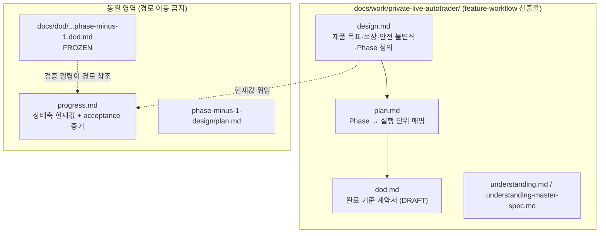
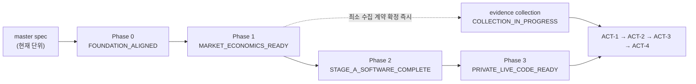

# 개발자 이해문서 — PRIVATE LIVE master specification 재작성

- PR/MR: 생성 전 (브랜치 `docs/private-live-autotrader-master-spec` ← `dev`)
- 기준 커밋: `15cc02f` (PR #63 merge)
- 작성: 2026-07-27 · 문맥: `warm`

## 1. TL;DR

- PRIVATE LIVE 자동매매 프로그램의 마스터 계획을 **상세 구현 계획에서 상위 specification으로 재작성**하고, 저장소 실제 코드와 대조한 독립 리뷰(Review C)의 blocker 3·major 7·minor 7을 반영했다.
- 반영 결과로 requirement ID 8개(`ECO-5`, `SAFE-9`, `ECG-5`, `P1-O8`, `P2-O10`, `P3-O15`, `P3-O16`, `NOGO-0`)를 신설했고 기존 ID는 하나도 삭제하지 않았다.
- 이어서 첫 외부 관점 리뷰(codex adversarial review)에서 critical 1·high 5·medium 2를 받아 REBUT 없이 전부 반영했고, 그 결과 ID 6개(`SAFE-10`, `LIVE-11`, `PROM-4`, `P3-O17`~`P3-O19`)와 activation 상태 `ACTIVATION_RECOVERY_ONLY`를 추가로 신설했다.
- 프로그램 문서를 `feature-workflow` 산출물 계약(`docs/work/{slug}/design·plan·dod`)으로 정렬했다. 코드 변경은 없다.

## 2. 왜

기존 마스터 계획은 roadmap, 상세 설계, 운영 절차, PR 체크리스트를 한 문서가 모두 소유했다. 그래서 구현 세부가 바뀔 때마다 마스터가 흔들렸고, Phase를 실제로 수행하는 agent가 최신 코드를 보고 판단할 여지를 미리 닫아버렸다. 사용자는 이를 상위 specification으로 재작성하고 PR 분할은 각 Phase consumer가 `work`에서 결정하도록 승인했다.

재작성본은 Claude 독립 리뷰 A·B를 거쳐 승인 대기 상태였는데, 이번에 **저장소의 실제 코드·스키마와 대조**하는 관점(Review C)에서 다시 검토하자 문서 내부적으로는 정합적이지만 현실과 어긋나는 계약 세 가지가 드러났다.

1. **정본 identity가 거래 범위를 표현하지 못함** — `ARCH-9`이 `MarketPair(symbol, koreaExchange, foreignExchange)`를 정본으로 못박았는데, 제품 범위(§1.2)의 해외 leg는 Binance USDT 선형 perpetual이다. `Exchange` enum에는 instrument 축이 없어 spot과 perpetual이 같은 `BTC:BITHUMB:BINANCE` 키로 붕괴한다. 실제로 batch는 이미 `wss://fstream.binance.com`(USD-M 선물)을 쓰고 있고 그 사실은 config URL에만 존재한다.
2. **장기 증거 clock이 사실상 0에서 재시작** — `Ticker`는 단일 `price`만 보존하고, 한국 leg는 Bithumb 24H ticker의 체결가, 해외 leg는 bookTicker의 **best bid/ask mid**다. 두 leg의 가격 의미가 다르고 호가 수량이 없어 기존 이력은 `DATA-3`(당시 실제 거래 가능한 가격·수량)을 소급 충족할 수 없다. §4.3은 `COLLECTION_IN_PROGRESS` 이전 데이터를 증거 기간에 산입하지 않는다고 이미 규정했지만, 그 규칙이 일정에 미치는 영향은 문서 어디에도 없었다.
3. **자동 이체가 없는 구조의 자본 소진** — §1.2가 거래소 간 자동 송금을 배제했는데, spot long / perp short 헤지는 cycle마다 두 leg의 손익이 서로 다른 통화·계정에서 반대 부호로 실현된다. 반복하면 한쪽 자본이 마르고 수동 재배치가 강제된다. `ECO-1`은 재배치 *비용*만 언급했을 뿐 실행 가능성 제약으로 다루지 않았다.

## 3. 무엇을 바꿨나

| 변경 | 내용 | 핵심 파일 |
|---|---|---|
| 스펙 재작성 반영 | Review C blocker 3 · major 7 · minor 7 반영, ID 8개 신설 | `docs/work/private-live-autotrader/design.md` |
| 문서 경로 정렬 | 마스터 스펙을 `feature-workflow` ④ 산출물 경로로 이동 (`git mv`) | `.ai/planning/.../task_plan.md` → `docs/work/private-live-autotrader/design.md` |
| 상위 plan 신설 | Phase 0~3을 workflow 실행 단위로 분해, 현재 태스크 T1~T11 | `docs/work/private-live-autotrader/plan.md` |
| DoD 계약서 신설 | AC1~AC8, 실행 가능한 검증 명령과 증거 로그, `status: DRAFT` | `docs/work/private-live-autotrader/dod.md` |
| 상태축 SSOT | 스펙의 현재값 중복 기록 제거, `progress.md`가 5축 현재값 단독 소유 | `progress.md`, `design.md` §0.1·§4.2 |
| 프로젝트 문서 최신화 | 프로그램 상태 절 신설, 문서 경로 규칙 반영 | `.ai/PROJECT_STATUS.md`, `CLAUDE.md` |
| Codex 리뷰 반영 | halt fence·복구 권한·margin headroom·config drift·budget 예약·holdout 재사용 금지, gate 실행 단위 표 | `design.md`, `plan.md` |

신설 ID와 대응 관계는 다음과 같다.

| ID | 계약 |
|---|---|
| `ECO-5` | 재배치 없이 가능한 cycle 수·소진 경로·재배치 lead time·실패 시 거동을 산출하고 `ACT-1` 필수 입력으로 삼는다 |
| `SAFE-9` | 양 leg 자본·margin이 헤지를 지지하지 못하면 신규 진입을 fail-closed하고 단일 leg 실행을 금지한다 |
| `ECG-5` | 프로그램 이전 수집 데이터의 evidence 적격성을 Phase 1 exit 전에 판정·기록하고 이후 재해석하지 않는다 |
| `P1-O8` | Phase 1 계약은 vertical proof consumer 하나로 관통 검증하고 나머지는 Phase 2로 이월한다 |
| `P2-O10` | 자본 제약이 전략 결과에 반영되고 헤지 불가 구간이 드러난다 |
| `P3-O15` | leg별 provider 검증 단계(fake·recorded → 실자금 없는 real protocol → 실계정)를 구분한다 |
| `P3-O16` | 자본 부족 시 진입 차단을 code-ready 단계에서 검증한다 |
| `NOGO-0` | 승인된 비용·기간 상한 도달 시 계속·축소·종결을 명시적으로 재평가한다 |

## 4. 설계

문서 소유 경계가 이번 변경의 핵심이다.



Phase는 하나의 MR이 아니라 각각 별도의 `feature-workflow` 실행 단위다.



## 5. 결정과 버린 대안

- **`ARCH-9`을 지금 확장하지 않고 최소 구성 요구로 재작성했다.** identity에 instrument 축을 당장 추가하는 안도 있었지만, 스펙이 타입 설계를 선점하면 §0.3의 소유 경계를 깬다. 대신 "정본 identity는 최소한 각 leg의 venue·instrument class·quote currency를 구분해야 한다"는 요구만 고정하고 확장 시점 판정을 `P0-O3`에 귀속했다.
- **기존 수집 이력을 증거로 소급 인정하지 않았다.** 인정하면 일정이 크게 앞당겨지지만 두 leg의 가격 의미가 다르고 호가 수량이 없어 executable premium을 재구성할 수 없다. 대신 엔진 검증·정성 참고로만 쓰도록 `ECG-5`에 명시했다.
- **`progress.md`를 옮기지 않았다.** 모든 문서를 `docs/work/{slug}/`로 모으는 편이 깔끔하지만, 동결된 Phase -1 DoD의 AC4 검증 명령이 `.ai/planning/private-live-autotrader/progress.md` 경로를 직접 참조한다. 이미 `VERIFIED`로 판정된 수용기준의 명령을 깨뜨리지 않는 쪽을 택했다.
- **동결 DoD는 손대지 않았다.** 그 문서의 `source:`가 가리키는 `task_plan.md §7`은 경로 이동과 재작성으로 이중 dangling 상태지만, 동결 문서 수정은 사용자 재승인 사항이라 기록만 남겼다.
- **`understanding.md` 본문의 "Phase -1~10 계획" 서술을 고치지 않았다.** PR #63 시점의 사실이므로 역사 기록으로 두고 깨진 링크 경로만 고쳤다.

## 6. 동작 확인 방법

코드 변경이 없으므로 검증은 문서 계약 위주다. 저장소 루트에서 실행한다.

```bash
# DoD AC1 — requirement ID 정합성 (dangling reference 0건)
python3 - <<'PY'
import re,sys
d=open('docs/work/private-live-autotrader/design.md',encoding='utf-8').read()
defined=set(re.findall(r'^\s*[-\d.]+\s+`([A-Z0-9]+-O?\d+)`',d,re.M))|set(re.findall(r'^`([A-Z0-9]+-O?\d+)`\s',d,re.M))
dangling=sorted(set(re.findall(r'`([A-Z]{3,5}-O?\d+)`',d))-defined)
print(f'defined={len(defined)} dangling={dangling}')
sys.exit(1 if dangling else 0)
PY

# DoD AC5 — 동결 산출물 무변경
git diff --quiet HEAD -- docs/dod/private-live-autotrader-phase-minus-1.dod.md && echo intact

# DoD AC6 — 저장소 문서 계약
bash docs/check-documentation.sh && git diff --check
```

기대 결과는 각각 `defined=121 dangling=[]`, `intact`, `documentation check passed (20 files, 15 required paths)`이며 모두 exit 0이다. AC2~AC4의 명령과 증거 로그는 [`dod.md`](dod.md)에 있다.

## 7. 후속·리스크·함정

- **아직 승인 전이다.** `dod.md`는 `status: DRAFT`이고 판정은 `AWAITING_HUMAN`이다. 사용자 승인과 `frozen_at` 기입 전에는 Phase 0을 시작하지 않는다.
- **Codex 외부 리뷰 1라운드를 반영했고 2라운드는 남아 있다.** critical 1·high 5·medium 2를 REBUT 없이 전부 수용해 halt fence(`SAFE-1`·`SAFE-6`), 복구 전용 권한(`LIVE-11`·`ACTIVATION_RECOVERY_ONLY`), margin headroom(`SAFE-7`), account configuration drift(`ACT-2`·`P3-O17`), budget 예약(`LIVE-8`·`P3-O18`), holdout 재사용 금지(`PROM-4`), `SAFE-1`/`SAFE-10` 분리, gate 실행 단위 표를 추가했다. Codex가 권고한 동일 시나리오 재검토는 아직 실행하지 않았다.
- **동결 DoD의 dangling 참조**: `docs/dod/private-live-autotrader-phase-minus-1.dod.md`의 `source:`가 존재하지 않는 경로와 사라진 `§7`을 가리킨다. 수정하려면 재승인이 필요하다.
- **로컬 `dev`가 뒤처져 있다.** 로컬 `dev`는 `b877d42`(PR #62), `origin/dev`는 `15cc02f`(PR #63)다. `git diff dev...HEAD` 같은 명령은 PR #63 내용까지 포함하니 비교 기준을 `origin/dev`로 잡아야 한다.
- **함정 — 문서 경로**: 마스터 스펙을 `.ai/planning/.../task_plan.md`에서 찾으면 없다. `docs/work/private-live-autotrader/design.md`가 정본이고, 상태축 현재값만 `progress.md`가 소유한다. 이 둘을 헷갈려 스펙에 현재 상태를 다시 적으면 `AC3`가 깨진다.
