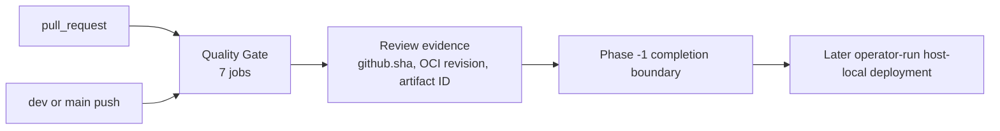
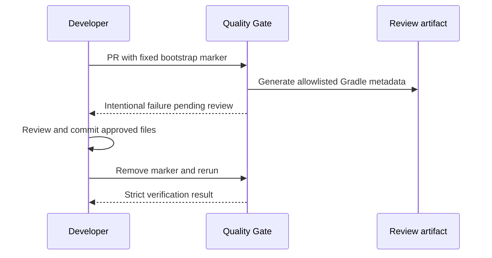

# 개발자 이해문서 — 개인용 PRIVATE LIVE 자동매매 기반 구축

- PR/MR: [#63](https://github.com/geonyeop123/premium-spread/pull/63)
- 브랜치: `feat/private-live-autotrader` ← `dev`
- 작성: 2026-07-21 · 문맥: `warm`

## 1. TL;DR

- 이 PR은 기존 관측 프로젝트를 개인 단일 계정용 `PRIVATE_LIVE`까지 확장하는 마스터 계획을 추가하고, 그 첫 단계인 Phase -1 검증 경계를 완료했다.
- Phase -1은 Quality Gate를 PR과 `dev`/`main` push로 단순화하고 custom SHA 체계와 secret-bearing deploy workflow를 제거해 CI와 host 운영 책임을 분리한다.
- 실제 전략·주문 코드는 아직 추가하지 않았고 host, credential, 배포, activation, 실거래도 실행하지 않았다. 현재 완료 범위는 이후 개발을 위한 계획·CI·운영 계약이다.

## 2. 왜

프로젝트의 제품 목표가 `SIMULATION + PAPER`에서 한 명의 소유자와 한 쌍의 개인 거래소 계정만 지원하는
`PRIVATE_LIVE`로 확장됐다. 그러나 기존 저장소에는 실제 운영 환경이 없는데도 GitHub Actions가 운영 secret을 받아 SSH로
배포하는 workflow가 있었고, Quality Gate에는 사용자가 입력한 target SHA, 별도 dependency fingerprint와
`SHA256SUMS` bundle처럼 Git·GitHub·Gradle이 이미 제공하는 무결성 정보 위에 자체 추적 계층이 겹쳐 있었다.

이 상태에서 실주문 기능부터 추가하면 다음 문제가 생긴다.

- PR 검증 결과와 실제 merge 결과의 의미가 섞여 잘못된 artifact를 배포 후보로 승격할 수 있다.
- 존재하지 않는 운영 체계를 전제로 CI가 production, SSH, exchange credential의 소유자가 된다.
- dependency 갱신 절차가 복잡해져 실제 검토 대상인 Gradle lock과 verification metadata보다 custom marker 검증이 중심이 된다.
- runner에 기본 설치되지 않은 도구 같은 숨은 환경 의존성이 원격에서만 실패할 수 있다.

따라서 Phase -1의 목표는 자동매매 기능 구현이 아니라 이후 Phase가 출발할 검증·배포 책임 경계를 먼저 단순하고 검증
가능하게 고정하는 것이다. 다음 제약도 함께 지켰다.

- 신규 self-hosted/JIT runner와 deploy·soak·migration·activation workflow를 만들지 않는다.
- GitHub Actions에는 production 또는 exchange credential을 제공하지 않는다.
- Git commit ID, OCI revision, GitHub artifact ID, Action commit pin, Gradle/Flyway/quality-tool checksum 같은 표준
  무결성 정보는 유지한다.
- 기존 7개 Quality Gate job, strict Gradle verification과 fail-closed NVD update/scan 순서는 유지한다.
- 실제 host와 secret source가 없으므로 배포 및 activation을 완료했다고 기록하지 않는다.

## 3. 무엇을 바꿨나

| 영역 | 변경 | 핵심 파일 |
|---|---|---|
| 프로그램 계획 | SIMULATION, PAPER를 필수 검증 단계로 유지하면서 gated PRIVATE_LIVE까지 가는 Phase -1~10 계획, 모듈 경계, 상태 모델과 완료 조건을 정의했다. | [마스터 계획](../../../.ai/planning/private-live-autotrader/task_plan.md), [Phase -1 설계](../../../.ai/planning/private-live-autotrader/phase-minus-1-design.md), [Phase -1 실행 계획](../../../.ai/planning/private-live-autotrader/phase-minus-1-plan.md) |
| 완료 계약과 증거 | Phase -1 수용기준 4개와 RED/GREEN, 리뷰, 로컬·원격 검증 증거를 동결했다. | [DoD](../../dod/private-live-autotrader-phase-minus-1.dod.md), [진행 기록](../../../.ai/planning/private-live-autotrader/progress.md) |
| Quality Gate | trigger를 `pull_request`, `dev`/`main` push로 제한했다. artifact name, image tag, OCI revision과 summary의 commit을 `github.sha`로 맞추고 platform artifact ID를 기록한다. | [quality-gate.yml](../../../.github/workflows/quality-gate.yml), [quality-gate-contract-test.sh](../../../ci/quality-gate-contract-test.sh) |
| 과한 custom 추적 제거 | `workflow_dispatch` SHA 입력, `TARGET_SHA`, checkout ref override, target verifier, dependency fingerprint와 review bundle의 `SHA256SUMS`를 삭제했다. | 삭제된 `ci/verify-target-sha.sh`, 삭제된 `ci/dependency-fingerprint.sh`, [bootstrap output validator](../../../ci/validate-dependency-bootstrap-output.sh) |
| Dependency bootstrap | dependency 변경 PR에서만 exact one-line marker를 허용하고, allowlisted Gradle lock·verification metadata review artifact를 만든 뒤 의도적으로 실패하게 했다. 검토·반영 후 marker를 제거한 strict run만 통과한다. | [request validator](../../../ci/check-dependency-bootstrap-request.sh), [generator](../../../ci/generate-dependency-bootstrap.sh), [behavioral contract](../../../ci/dependency-bootstrap-contract-test.sh) |
| 배포 책임 | 운영 secret과 SSH를 받던 `.github/workflows/deploy.yml`을 삭제했다. 기존 `docker/deploy.sh`의 no-host-build, migration/readiness, smoke, rollback 계약은 host-local operator 절차로 유지했다. | [배포 계약 테스트](../../../docker/deploy-contract-test.sh), [배포 런북](../../runbooks/deployment.md), [AWS host setup](../../deploy/aws-setup.md) |
| runner 호환성 | Quality/documentation contract의 `rg` 의존을 runner 기본 `grep`/`find`로 이식하고 검사 의미를 유지했다. | [quality-gate-contract-test.sh](../../../ci/quality-gate-contract-test.sh), [check-documentation.sh](../../check-documentation.sh) |
| 상태 명시 | secret-bearing workflow 제거, host-local owner, 실제 환경 미구성 상태를 활성 문서에 일치시켰다. | [PROJECT_STATUS](../../../.ai/PROJECT_STATUS.md), [runtime profile](../../runbooks/configuration-profiles.md), [auth security](../../runbooks/auth-security.md) |

애플리케이션 Kotlin/TypeScript runtime 코드는 이번 Phase에서 변경하지 않았다. `apps:strategy`, `apps:live-executor`, 주문
상태 머신, PnL/Risk 엔진과 private exchange adapter는 마스터 계획에 정의됐을 뿐 아직 구현되지 않았다.

## 4. 설계

Phase -1 이후 CI와 향후 host 운영의 책임 경계는 다음과 같다.



PR run은 review evidence다. 향후 ReleaseCandidate 입력은 merge 뒤 실제 `event=push`, `branch=dev`인 green run만 허용하며,
Phase -1에서는 오른쪽의 host-local 배포를 실행하지 않았다.

Dependency를 추가할 때의 예외 흐름은 다음과 같다.



marker run의 실패는 acceptance 실패를 숨기는 예외가 아니라 사람이 생성 결과를 검토하도록 멈추는 명시적 상태다. marker가
없는 일반 run과 marker 제거 후 run은 committed metadata를 strict mode로 검증한다.

## 5. 주요 결정과 버린 대안

| 결정 | 이유 | 버린 대안과 trade-off |
|---|---|---|
| CI run identity는 `github.sha`를 사용한다. | event checkout과 artifact/image 증거가 플랫폼이 제공한 동일 identity를 사용한다. | 사용자 입력 `TARGET_SHA`, exact checkout verifier와 자체 candidate SHA orchestration을 제거했다. 구조는 단순해졌지만 PR의 `github.sha`는 merge ref일 수 있으므로 배포 후보로 사용할 수 없고 merged `dev` push run을 별도로 확인해야 한다. |
| custom dependency fingerprint와 `SHA256SUMS` bundle을 제거한다. | 검토 대상은 Gradle이 생성한 lock과 verification metadata이며 별도 hash chain의 운영 비용이 이득보다 컸다. | bundle 자체의 독립 checksum 목록은 사라졌다. 대신 Git commit, GitHub artifact ID, allowlist, Gradle SHA-256 metadata와 follow-up strict run에 의존한다. |
| 표준 SHA/checksum은 유지한다. | Action immutable pin, Gradle dependency verification, Flyway checksum과 quality-tool download checksum은 실제 공급망 검증에 사용된다. | 모든 `SHA256` 문자열을 일괄 제거하는 방식은 dependency 검증과 migration 무결성을 약화하므로 채택하지 않았다. |
| GitHub Actions는 검증까지만 담당한다. | 현재 운영/스테이징과 runner 운영 경험이 없고 production/exchange credential을 CI에 넣지 않는 것이 V1 책임 경계에 맞다. | secret-bearing deploy workflow와 신규 self-hosted/JIT runner를 제거·제외했다. 자동 배포 편의성은 줄고 operator 절차 부담은 늘지만, 실제 host가 준비되기 전부터 허구의 자동화와 secret 경계를 유지하지 않는다. |
| Dependency bootstrap은 PR-only 고정 marker로 최소화한다. | dependency 선언과 generated metadata를 한 PR에서 검토하고, review artifact 생성 뒤 의도적으로 멈출 수 있다. | parent SHA, branch, expiry, fingerprint, marker-only commit을 검증하던 6-field marker를 버렸다. 기계적 결속은 약해졌으므로 allowlist diff의 사람 검토와 marker 제거 후 strict green run이 필수다. |
| runner에 `rg`를 설치하지 않고 contract를 `grep`/`find`로 이식한다. | 신규 runner/bootstrap 책임을 추가하지 않고 GitHub-hosted runner 기본 도구만 사용한다. | shell 구현은 다소 장황해졌지만 원격 환경 의존이 줄었다. workflow YAML 구조를 바꾸면 textual contract도 함께 갱신해야 한다. |

## 6. 동작 확인 방법

구현 head `bc652c34e3823e6d715cb3cafea6f10dd36e31be` 기준 최신 PR Quality Gate run
[`29790757566`](https://github.com/geonyeop123/premium-spread/actions/runs/29790757566)은 다음 7개 job이 모두 성공했다.

1. Compile + architecture
2. Unit + coverage
3. API integration
4. Batch integration
5. ktlint + detekt
6. Dependency + security scan
7. Docker image build

로컬에서 핵심 계약을 재현하려면 feature worktree에서 다음을 실행한다.

```bash
./gradlew compileKotlin test architectureTest --offline --no-daemon
bash ci/quality-gate-contract-test.sh
bash ci/dependency-bootstrap-contract-test.sh
bash docker/deploy-contract-test.sh
bash docs/check-documentation.sh
for file in ci/*.sh docker/*.sh; do bash -n "$file"; done
git diff --check
```

Web 검증은 Node 20.9 이상에서 실행한다.

```bash
npm --prefix apps/web ci --include=optional
npm --prefix apps/web run lint
npm --prefix apps/web run build
```

작업 환경의 Node 18.20.8에서는 Next.js 16의 최소 버전 검사 때문에 로컬 build가 애플리케이션 compile 전에 차단됐다.
install과 lint는 통과했고, Node 20을 사용한 원격 Web/Docker job으로 build 성공을 확인했다. 실제 host 배포와 activation은
Phase -1 범위에서 `NOT_RUN`이므로 이 PR의 검증 결과로 실거래 준비 완료를 판단하면 안 된다.

## 7. 후속·리스크·함정

- 이 PR의 현재 구현 범위는 Phase -1이다. 마스터 계획에 적힌 `apps:strategy`, `apps:live-executor`, PnL/Risk, outbox,
  reconcile, kill-switch와 거래소 주문 adapter는 아직 존재하지 않는다.
- PR merge는 최대 코드 준비 과정의 한 단계일 뿐 실거래 승인이 아니다. 실제 LIVE 완료는 같은 `ReleaseCandidateId`로
  법률·거래소·전략·보안·host·canary·LIMITED evidence gate를 모두 충족해야 한다.
- PR artifact는 배포 후보가 아니다. PR의 `github.sha`가 merge ref일 수 있으므로 향후 operator는 merged `dev`의 push
  run, commit, OCI revision과 artifact ID를 다시 대조해야 한다.
- 자동 deploy workflow가 없어졌으므로 향후 배포는 operator가 검증 artifact 확보, registry publish, host secret 주입,
  migration/readiness/rollback을 직접 수행하고 증거를 남겨야 한다. 이 절차 자체는 아직 실제 host에서 검증되지 않았다.
- 고정 dependency marker는 단순한 대신 사람 검토가 안전성의 일부다. generated allowlist 밖 변경, marker가 남은 commit,
  의도된 red run을 acceptance green으로 해석하는 실수를 피해야 한다.
- NVD API key 없이도 현재 fail-closed update/cache/scan 계약은 동작하지만 rate limit과 초기 update 시간이 늘 수 있다. 이를
  이유로 update 실패를 무시하거나 scan을 `continue-on-error`로 바꾸면 안 된다.
- `deploy/`의 과거 script/template은 호환 참고용으로 남아 있지만 `deploy/README.md`가 명시하듯 활성 배포 경로가 아니다.
  서버 source pull/build 경로를 되살리지 않는다.
- 마스터 계획의 법률·거래소 자료는 2026-07-20 확인 기준이며 activation 시점에 다시 확인해야 한다. 문서는 법률·세무
  결론을 대신하지 않는다.
- 다음 구현 단위는 Phase 0의 시장 identity·실행 가능한 호가·raw archive clock이다. 같은 장기 Draft PR에 후속 Phase가
  추가되면 이 이해문서도 실제 구현 범위와 검증 결과에 맞춰 갱신해야 한다.
